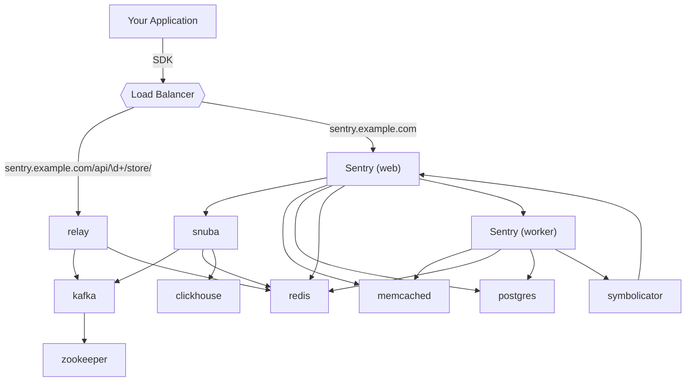

# Mermaid Guide

> As visual creatures, humans tend to benefit from visual aids when acquiring new information, regardless of its complexity.

## What is Mermaid?

Mermaid is an open source diagramming and charting tool that lets you create flowcharts and diagrams with Markdown-inspired syntax. It is a wonderful way to visually explain flows, dependencies, and other aspects of your codebase. Mermaid won the JS Open Source Awards (2019) for "the most exciting use of technology." 🥇

## Benefits of diagrams in your docs

The impact of diagrams in your documentation are many. Here’s a closer look at the benefits.

#### Architecture overview

When approaching a large codebase, there is so much to learn, and it is quite easy to get overwhelmed. A good architectural diagram explains the different logical modules of a codebase and the main interactions between them.

You can use smart paths as well as definitions from the entry points of each module.

```javascript copy
console.log('ss')
```

Here is an example from Sentry’s documentation:

import { Tab, Tabs } from 'nextra-theme-docs'
 
<Tabs items={['Preview', 'Code']}>
  <Tab>

<div className="border rounded p-4">



</div>

  </Tab>
  <Tab>
    
```
graph TD
  app[Your Application] --> |SDK| lb{{Load Balancer}}
  lb --> |"sentry.example.com/api/\d+/store/"| relay
  lb --> |"sentry.example.com"| sentry_web["Sentry (web)"]
  symbolicator --> sentry_web
  relay --> kafka
  relay --> redis
  sentry_web --> snuba
  sentry_web --> memcached
  sentry_web --> postgres
  sentry_web --> redis
  snuba --> kafka
  snuba --> redis
  snuba --> clickhouse
  kafka --> zookeeper
  sentry_web --> sentry_worker["Sentry (worker)"]
  sentry_worker --> memcached
  sentry_worker --> redis
  sentry_worker --> postgres
  sentry_worker --> symbolicator

click snuba "https://github.com/getsentry/snuba" "Snuba Documentation"
click relay "https://github.com/getsentry/relay" "Relay Documentation"

````

  </Tab>

</Tabs>

Here is another example (from k8s documentation, “What is Ingress”):

<div className="border rounded p-4 mt-2">

```mermaid
graph LR;
  client([client])-. Ingress-managed <br> load balancer .->ingress[Ingress];
  ingress-->|routing rule|service[Service];
  subgraph cluster
  ingress;
  service-->pod1[Pod];
  service-->pod2[Pod];
  end
  classDef plain fill:#ddd,stroke:#fff,stroke-width:4px,color:#000;
  classDef k8s fill:#326ce5,stroke:#fff,stroke-width:4px,color:#fff;
  classDef cluster fill:#fff,stroke:#bbb,stroke-width:2px,color:#326ce5;
  class ingress,service,pod1,pod2 k8s;
  class client plain;
  class cluster cluster;
````

</div>

```mermaid
graph TD;
  A[[fa:fa-user-tie Mr Goh - President]]:::lightcoral --> B(fa:fa-user-tie Mr Chu - Vice President);
  A --> C(fa:fa-user-tie Mr Tan - Secretary);
  B --> D([fa:fa-money-check-alt Finance Manager]);
  B --> E([fa:fa-laptop-code IT Manager]);
  B --> F([fa:fa-users HR Manager]);

  style A fill:lightcoral, stroke: black;
  style B fill:orange, stroke: black;
  style C fill:orange, stroke: black;
  style D fill:lightblue, stroke: black;
  style E fill:lightblue, stroke: black;
  style F fill:lightblue, stroke: black;
```
